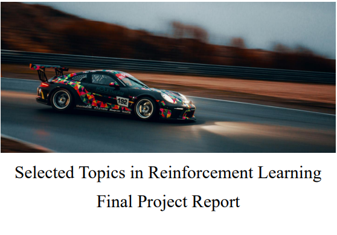

# NYCU 114-1 強化學習專論
---
> 本專案為 **「強化學習專論」(Selected Topics in Reinforcement Learning)** 課程的實作與專案成果，涵蓋從基礎 RL 概念到 DQN、PPO、TD3 及最終專案實作，完整展示強化學習的應用與能力。

---

## 🏆 **課程資訊**
- **課程名稱**：強化學習專論（Selected Topics in Reinforcement Learning）  
- **授課單位**：資科工碩 | 課號：535518 | 學分數：3.0  
- **授課教師**：吳毅成  
- **先修建議**：Machine Learning / Deep Learning  
- **課程目標**：
  1. 掌握強化學習 (RL) 的核心概念
  2. 了解最新 RL 技術及其應用
  3. 熟悉 RL 開發工具，如 PyTorch、Gazebo 等
  4. 透過專案實作應用 RL（如 DeepRacer、自主駕駛等）

---

## 🔥 **實作內容**

| 📂 專案名稱 | 🎯 內容 | 🚀 方法 | 📌 關鍵技術 |
|------------|---------|--------|------------|
| **Lab1-2048** | 2048 遊戲的 RL 解法 | Q-Learning | MDP、狀態值估計 |
| **Lab2-DQN** | 使用 DQN 進行遊戲訓練 | Deep Q-Network | Q-Learning、Experience Replay |
| **Lab3-PPO** | Proximal Policy Optimization | Policy Gradient | Actor-Critic、Advantage Estimation |
| **Lab4-TD3** | Twin Delayed Deep Deterministic Policy Gradient | Continuous Control | DDPG、Delayed Policy Update |
| **Final-LAB** | 期末專案-racecar_gym | 自行應用所學 | RL-based Optimization |

🛠 **技術棧**：
- **程式語言**：Python
- **框架**：PyTorch
- **演算法**：DQN, PPO, TD3, Policy Gradient
- **環境**：Gym, Stable-Baselines3
- **開發工具**：Jupyter Notebook, Docker , Git , vscode

---

## 🏅 **專案特色**
✅ **涵蓋 Value-Based & Policy-Based 方法**：從 DQN 到 PPO，掌握強化學習主要策略  
✅ **強調實作與應用**：不僅理解理論，還將 RL 應用於不同訓練場景  
✅ **處理連續動作空間**：透過 DDPG、TD3 來解決連續控制問題  

---

## 📖 **課程大綱**
1️⃣ **核心概念**：馬可夫決策過程 (MDP)、動態規劃、Q-Learning  
2️⃣ **強化學習演算法**：DQN, DDQN, Dueling DQN, Policy Gradient, PPO, TD3  
3️⃣ **應用領域**：DeepRacer、Rubik’s Cube 解法、優化 (JSP/TSP)  
4️⃣ **進階探索技術**：AlphaGo、MuZero、多代理 RL (MARL)  
5️⃣ **強化學習規劃**：MCTS, Path Consistency, Abstraction  

📌 **完整課程大綱請見：[課程進度表](https://timetable.nycu.edu.tw/?r=main/crsoutline&Acy=113&Sem=1&CrsNo=535518&lang=zh-tw)**

---

## 📈 **學習成果**

**Final-LAB排名: 5/84** 

---

## 🤝 **聯絡方式**
如果你對我的 RL 實作有興趣，或有任何問題，歡迎聯繫：

📧 **Email**: clu98753.cs13@nycu.edu.tw 

📌 **GitHub**: [alu98753](https://github.com/alu98753)  

---
施工中:

📌 **更多訓練結果請見 [`results/`](./results/)**
